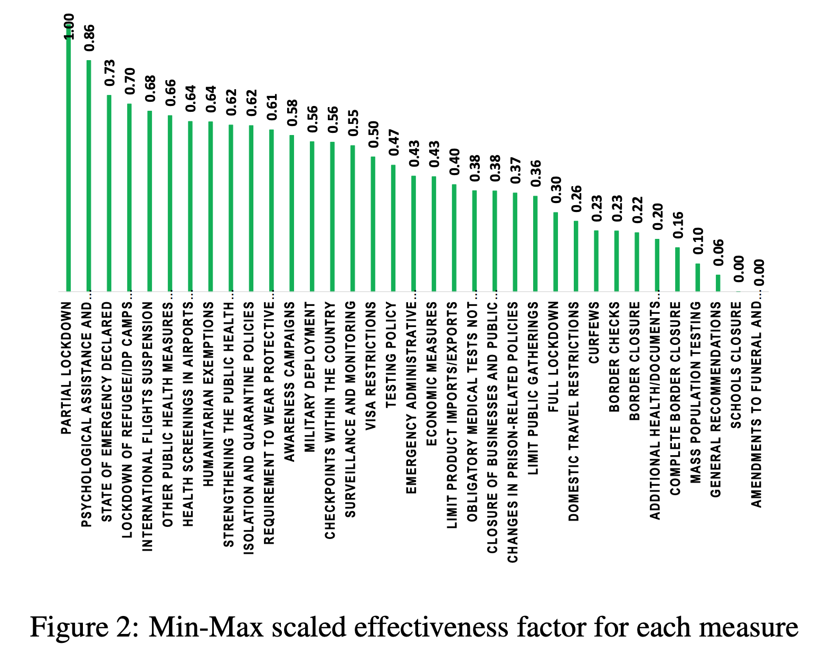
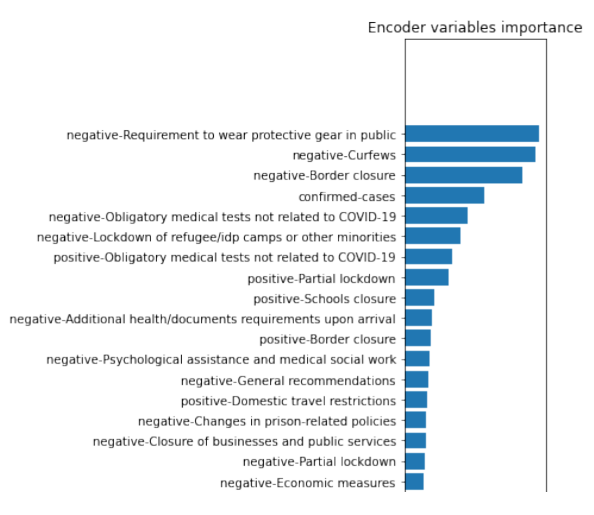

# STAT 946 Deep Learning Project
Title: Analysis of COVID-19 Measures Impacts on the Trend of New Confirmed Cases Using Deep Learning

Our most significant contributions are:
- Two labeling method (binary and continuous) are proposed for quantifying policy effectiveness on
COVID-19 new cases trend

- A classification MLP and a regression MLP are developed based on the proposed labeling methods
in order to predict and compare the effectiveness of policies
- A time series forecasting model has been developed using a recent method called Temporal Fusion
Transformer which can estimate the trend of new cases considering historical trend and applied
policies.

